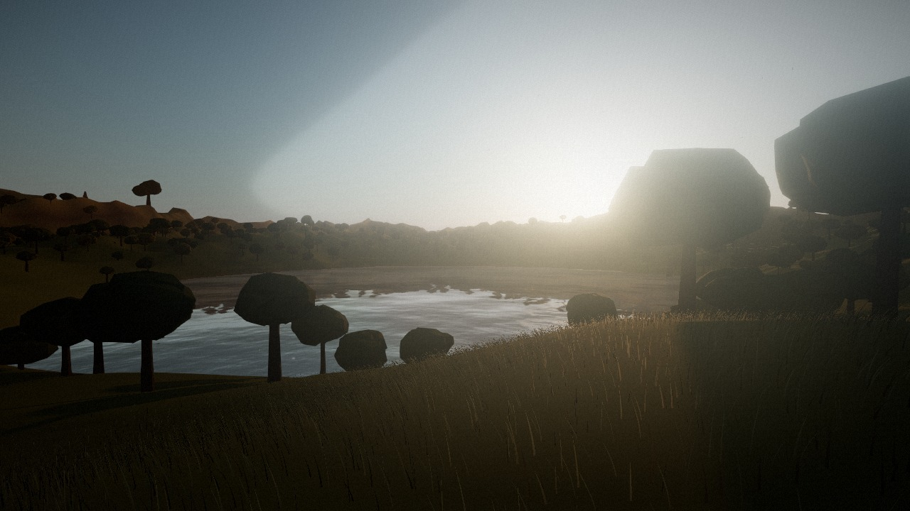
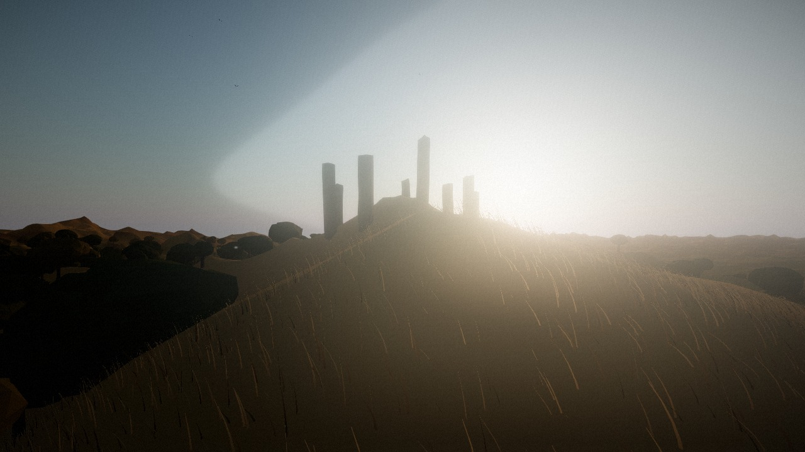
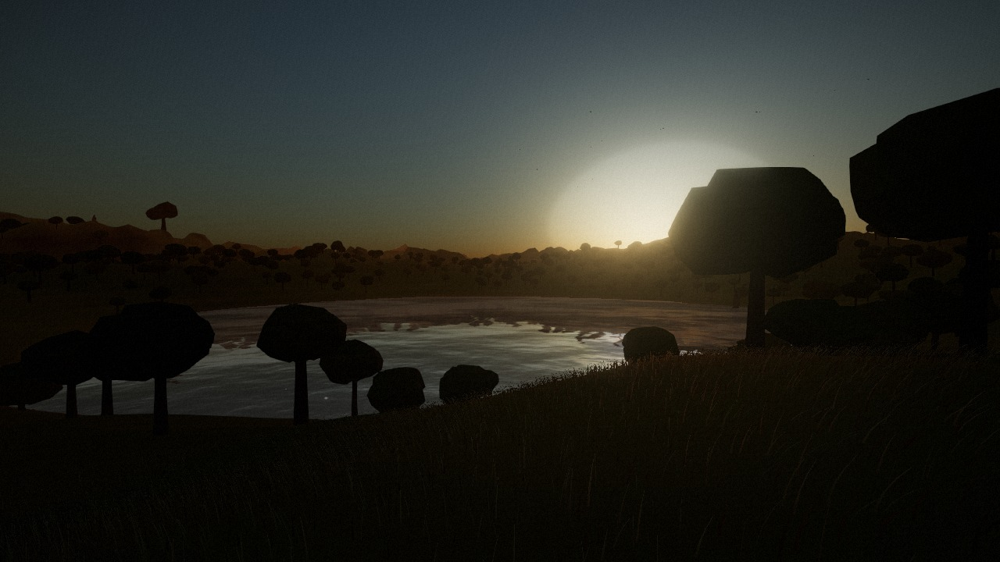

# Highlands

A walkable world in the browser. Rolling noise-carved hills, wind-rippled grass, a mirror lake, and
stone landmarks on the far ridges to walk toward — under a sun that crosses the sky on a real solar
path, weather that comes and goes, deer you have to stalk downwind, and bears that hunt you back.

**Everything you see and hear is generated in code.** No models, no textures, no HDRIs, no audio
files anywhere in this repository.

> Where this is going: **[VISION.md](VISION.md)** — the folkloric pivot, survival, self-hosted
> multiplayer and building, in sequence. This README describes what exists *today*.



<p align="center"><em>The opening view. The spawn point is chosen by searching the terrain — see
"The landmarks are sited, not typed in" below.</em></p>

|  |  |
|---|---|
|  |  |
| The monolith ring, backlit on the high ridge | The same world with the sun scrubbed down to dusk using `[` |

**Everything you see is generated in code.** There are no models, no textures, no HDRIs, no audio
files anywhere in this repository — the terrain comes out of a noise function, the sky out of an
atmospheric-scattering shader, the water's normal map is baked at load time, and the wind and
birdsong are synthesized with oscillators.

```bash
npm install
npm run dev      # http://localhost:5173
```

---

## Controls

| Key | |
|---|---|
| `W` `A` `S` `D` | walk |
| `Shift` | sprint |
| `C` | crouch, as a toggle — quieter, lower, harder to see |
| `Space` | jump (up, in free-fly) |
| `G` | light a fire (costs a branch) |
| **`B`** | **build — whatever your camp is still missing** |
| `E` | cut a tree · quarry a rock · use a store · take bearings · open a barrow |
| `R` | eat |
| **`Mouse 1`** | **bow: hold to draw, release to loose · axe: hold to wind up, release to swing** |
| `E` | pick up |
| `Q` | drop what you're holding |
| `1` `2` / wheel | change item |
| `F` | free-fly camera — no gravity, no collision |
| `[` `]` | scrub the clock |
| `T` | pause / resume time |
| `P` | save a screenshot |
| `H` | hide the interface |
| `M` | mute |
| `N` | toggle bloom |
| `?` | show the keybinds again |
| `Esc` | release the mouse |

Mouse look normally uses pointer lock. If the page is embedded in an iframe that hasn't been
granted `allow="pointer-lock"`, the browser refuses it with a `SecurityError` — the world detects
that, says so, and falls back to **hold the left mouse button and drag** to look around.

---

## How the world is made

### The height function is the world

`src/world/noise.js` exposes `heightAt(x, z)` — a pure function with no state. Everything follows
from that one decision:

- **Terrain chunks** can be built, thrown away and rebuilt at any resolution, in any order, and
  always agree with each other.
- **Collision is exact and free.** "Where is the floor?" is one function call, so there is no
  physics engine, no colliders and nothing to tunnel through.
- **The world is reproducible.** Same seed, same world, forever.

The shape itself is layered noise with **domain warping** — the sample coordinates are distorted
before the height is read. That one step is the difference between generic lumps and carved
ridgelines. Ridged noise adds the peaks, but only where a large-scale mask permits, so there are
real highlands and real open lowlands rather than uniform bumpiness. A smooth radial carve sinks
the lake basin, and the shoreline simply emerges wherever the blended height crosses the waterline
— beaches on gentle ground, bluffs where the land was already high.

### Terrain streaming

`src/world/terrain.js` keeps a 13×13 grid of chunks around you at five levels of detail: 2 m
triangles underfoot, 13 m triangles out at the fog wall. Two details make that seamless:

- **Normals come from the analytic height gradient**, not from the mesh. A distant low-res chunk
  therefore shades identically to a near high-res one, so LOD changes never pop.
- **Every chunk hangs a skirt** from its four edges. Where a high-res edge meets a low-res
  neighbour, the hairline crack shows skirt instead of sky.

### Light

One number — the sun's elevation — drives the sky shader, the sun's colour and intensity, the fog
tint, the skylight fill and the water's specular. They cannot disagree with each other, which is
why scrubbing `[` and `]` changes the mood of everything at once instead of just moving a light.

Two choices worth knowing about:

- **Exposure is very low (0.26)** because the Preetham sky shader emits values in the hundreds;
  anything higher and ACES clips the entire sky to white. The sun's intensity is raised to
  compensate.
- **The skylight fill is strong and deliberately cool.** At golden hour the sun is warm and nearly
  horizontal, so everything it misses is lit only by the blue dome overhead. Without that fill,
  shadows crush to solid black — and the warm/cool split is half of why golden hour looks the way
  it does.

Terrain does **not** cast shadows. At this sun angle a hill's shadow is hundreds of metres long
and would clip against the shadow camera; the analytic normals already give the raking light its
bite. Trees, rocks and landmarks do cast, inside a tight shadow frustum that follows you.

### Grass, trees, rocks

All instanced, all placed from a positional hash so nothing swims or pops as the field re-centres
on you. Two things in `src/world/scatter.js` are worth reading:

- **`attachWind`** puts the sway in the vertex shader. The subtle part: each blade has its own Y
  rotation, so the world-space wind direction is rotated into each instance's local frame — skip
  that and every blade bends its own way and the field never reads as a coherent gust. The phase
  comes from world position, so the gust *travels* across the field instead of everything pulsing
  in unison. Trees get the same treatment on a matching depth material, so a swaying tree's shadow
  sways with it.
- **`HeightGrid`** caches a coarse local grid of terrain heights and interpolates. Placement asks
  "how high, how steep" tens of thousands of times per rebuild; calling the full noise stack each
  time costs tens of milliseconds, and the terrain has no features below ~40 m wavelength anyway.

### The landmarks are sited, not typed in

Random scatter never composes a view. `src/world/landmarks.js` *searches* the terrain for the
ground each landmark wants — the highest ridge toward the sun, the deepest gully, the top of the
world — and builds there. Because the search reads the same deterministic height function, siting
is reproducible without hardcoded coordinates that a seed change would invalidate. Each landmark
also keeps a radius clear of trees and boulders, so the scatter doesn't bury the thing you walked
over to look at.

The spawn point is chosen the same way: stand on the shore *opposite* the sun, so the specular
streak runs across the water straight at you, then face the lake — which also faces the monolith
ridge beyond it. One position, three layers of depth.

### Movement

`src/player/cameraFeel.js` is where "walking" lives rather than "a camera moving through terrain".
The one non-obvious choice: **head bob is driven by distance travelled, not elapsed time.** A
time-based bob desyncs from your legs the moment you sprint, because it keeps cycling while your
stride length changes. Distance-based bob stays locked at every speed — and lets the footsteps
fire on exactly the same phase.

Vertical bob runs at twice the lateral rate: one dip per footfall, one sway per full stride. That
2:1 relationship is what reads as walking.

### Day and night

The sun's position comes from real solar geometry — declination from the date, hour angle from the
clock, altitude and azimuth for a latitude — so it rises in the east, arcs south and sets in the
west, and **latitude and season genuinely change the path**. At the default 57°N in mid-July you get
sunrise at 03:31, sunset at 20:30 and a solar noon altitude of 54.5°, which are the real figures.
A full cycle takes 26 real minutes.

Preetham is a daylight model and has no idea what night is; held below the horizon it renders a
muddy grey dome. Three things fix that: a `uSkyDim` uniform patched into the sky shader scales the
dome's own output (which decouples *how bright the sky is* from *how bright the land is* — crushing
exposure would take the moonlit ground down with it), turbidity and rayleigh wind down toward dusk,
and exposure opens 2.15× once the sun is gone. A moon rides opposite the sun and takes over shadow
casting, so only ever one key light is enabled.

### Weather

A weighted state machine over clear, fair, overcast, drizzle, rain and mist. The states are pure
target values — nothing reads the state name — so adding "storm" is a row in the config table.

It isn't decoration. **Cloud kills the direct sun while *lifting* the ambient**, because an overcast
day is flat and shadowless rather than dark. Wind strength drives every grass and canopy shader at
once, so the whole landscape leans together when it gusts. And wind *direction* drifts continuously,
which matters because the scent model reads it — a stalk can go wrong halfway through.

Rain is drawn as one `LineSegments` call, because a drop at speed **is** a streak. More importantly
it masks you: at full downpour your noise carries 30% as far and your scent 25% as far. Hunting in
bad weather is a real tactic.

### Hunting

Arrows carry their own gravity (12.5, not the player's stylised 26) tuned against a 74 m/s launch,
with quadratic drag — so the arc flattens on the way out and steepens coming down instead of being a
symmetric parabola. The arrow is rotated onto its own velocity each frame, so it visibly noses over.
Drop is ~0.5 m at 20 m, 1.9 m at 40 m, 8.2 m at 80 m.

Creatures run a single **awareness meter** fed by four independent senses — sight, hearing, scent
and proximity — which decays when nothing feeds it. Sneaking falls out of that model rather than
being special-cased: freezing when a head comes up genuinely works, because the meter is falling.
Approaching a grazing deer from 80 m:

| | Bolts at |
|---|---|
| Sprinting, downwind | 25 m |
| Walking, downwind | 8 m |
| Crouch-walking, downwind | 2 m |
| Crouch-walking, **upwind** | 60 m |

Check the wind before you check your feet.

Bears use the same senses with a different brain. A bear charges at 11.5 m/s against your 8.6 m/s
sprint — but only for seven seconds, after which it drops below your pace. Running is the wrong
answer to the first rush and the right answer to the second. Shooting one makes it press *harder*,
not scatter.

---

## Tuning it

Every constant lives in **`src/config.js`**, each with a comment on what it does. Some worth
playing with:

| | |
|---|---|
| `SEED` | change the world entirely |
| `QUALITY` | `'low'` / `'medium'` / `'high'` — view distance, density, shadows, post |
| `SKY.elevation` | the default time of day |
| `SKY.exposure` | brightness; interacts with `light.intensity` in `sky.js` |
| `SKY.fogDensity` | how far you can see |
| `TERRAIN.warpAmp` | how carved vs how lumpy the land is |
| `TERRAIN.ridgeAmp` | mountain height |
| `LAKE` | position, size and depth of the water |
| `WIND.grassStrength` | how hard the grass leans |
| `Q.grassDensity` | blades per m² near the camera |
| `PLAYER.accel` | exponential rate; ~9 is a 110 ms ramp, 40 is arcade-instant |
| `FEEL.bobAmpVertical` | head bob depth |

---

## Performance

Measured with `EXT_disjoint_timer_query_webgl2` on an RTX 4090, `QUALITY: 'high'`:

| Scene at 1920×1080 | GPU | |
|---|---|---|
| Clear noon | 1.9 ms | ~533 fps |
| Heavy rain (2,600 drops) | 1.7 ms | ~601 fps |
| Night, stars, moonlight | 1.7 ms | ~605 fps |

Weather and night cost essentially nothing — cloud dims the sun, which cancels out the extra
geometry. That is a top-end GPU; the margin is wide enough that a mid-range discrete card should
hold 60 fps comfortably. Drop `QUALITY` to `'medium'` on integrated graphics.

A 1.4 in-world-day soak with weather cycling through all six states produced no NaN, no invalid
fog or exposure values, and both a sunrise and a sunset.

Guardrails: pixel ratio capped at 1.5; instancing everywhere; no allocation in the update loop;
placement re-run on a travel threshold rather than per frame; the reflective water — the single
most expensive object — switches off once you walk out of range; and the simulation runs on a
clamped fixed timestep so alt-tabbing doesn't launch you into orbit.

---

## Layout

```
src/
  main.js              bootstrap, render loop, key bindings
  config.js            every tunable constant
  world/
    noise.js           seeded PRNG, domain warping, heightAt() — the world
    terrain.js         chunk streaming, LOD, skirts, slope/altitude colouring
    water.js           the lake
    scatter.js         instanced grass / reeds / trees / rocks + shader wind
    landmarks.js       terrain search, the five landmarks, spawn composition
    sky.js             solar path, sky dome, moon, stars, fog, mist
    weather.js         state machine driving cloud, wind, fog and rain
    colliders.js       spatial hash of analytic proxies for trees/rocks/stone
    projectiles.js     generic ballistics, one instanced draw call
    pickups.js         recovered arrows, dropped items, deterministic loot
  creatures/
    registry.js        species as data — hp, senses, drops, body builders
    creature.js        awareness meter, state machines, procedural gait
    manager.js         hash-placed herds, despawn, distance-LOD, separation
  items/
    registry.js        every item as data; procedural geometry
    inventory.js       slots and stacks, weapon-agnostic
  weapons/
    weapon.js          the contract every weapon implements
    bow.js             draw-charge-release, spread, fatigue
  fx/
    composer.js        bloom -> ACES -> SMAA -> grain/vignette
    ambientLife.js     birds, butterflies, dust motes
    rain.js            streak rain in one LineSegments call
  player/
    controller.js      input, movement, collision against heightAt()
    cameraFeel.js      head bob, FOV kick, strafe lean, landing dip, shake
    stealth.js         your noise / visibility / scent profile
    vitals.js          health, damage, death, respawn
    viewmodel.js       held item in its own scene on a cleared depth buffer
  audio/
    soundscape.js      synthesized wind, water, rain, bow, growls, footsteps
  ui/
    hud.js             start screen, crosshair, hotbar, health, screenshots
  util/
    math.js            clamp / lerp / smoothstep / frame-rate independent damp
    textures.js        procedurally baked water normals, mist, sprites
```

### `window.highlands`

A handle is exposed on the console for poking at the world:

```js
highlands.warp(x, z, yaw, pitch, y)   // teleport; terrain is built before it returns
highlands.capture('name')             // render one frame to shots/name.jpg (dev server only)
highlands.stepWorld(1/60)             // advance and render one frame by hand
highlands.heightAt(x, z)              // the height function itself
highlands.atmosphere.nudge(+1)        // move the sun
```

`stepWorld` exists because `requestAnimationFrame` is suspended in a hidden tab, so being able to
drive a frame by hand is what makes the thing testable from a script. `capture` posts to a
dev-only Vite middleware (`vite.config.js`) that writes the JPEG to `shots/`.
